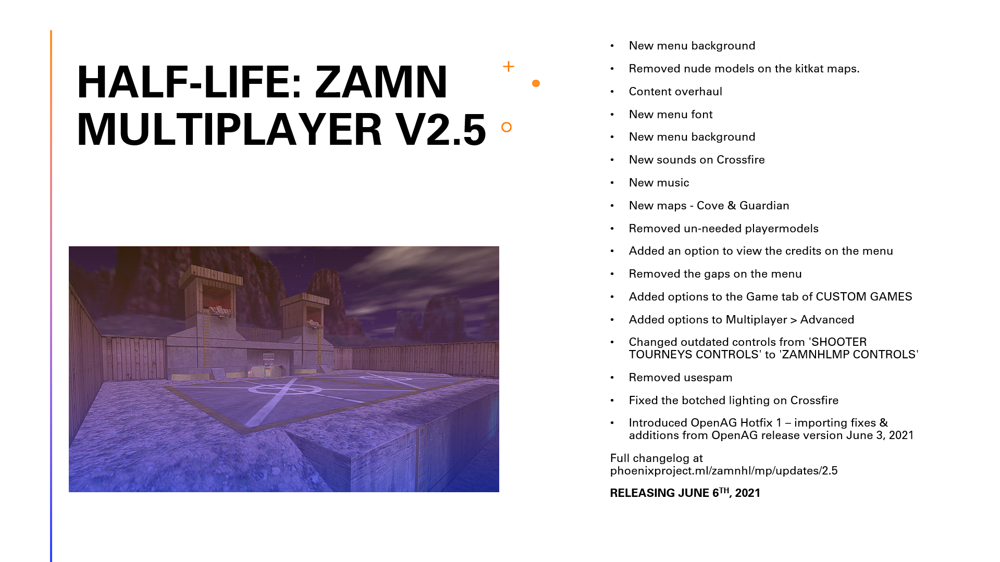

# Aura Server

This repository contains the serverside binary for Aura. Each subfolder has its own README file
(named readme.txt, readme or README.md).

## About Aura
Aura is a modification of Adrenaline Gamer created by Martin Webbrant and fireblizzard. It is
used by **The Phoenix Project Software** for the game [*Half-Life: Zombies Ate My Neighbours.*](https://moddb.com/mods/zamnhlmp)
Before ZAMNHLMP used Aura, Phoenix used a different codebase named *'creaTive Deathmatch Player,'*
which originally started development in April 2019. ZAMNHLMP started using **Aura** with version 2.4.

## History of Aura
### Creation
**Aura** is both separate from and the same thing as the CDM Player. It is more or less a rewrite of the old
codebase. Phoenix created the rewrite because the code of the CDM Player was messy, unorganised and
simply broken. It was best to start from fresh.

### Release
#### 1.0
Aura 1.0 was first released with ZAMNHLMP 2.4. New features included:
    
  - Discord Rich Precense
  - Minor fixes to audio
  - Cleaned codebase
  - Organised clientside and serverside SDK repos
Aura 1.0 was also included with ZAMNHLMP 2.5.

#### 1.1
Aura 1.1 was released with ZAMNHLMP 2.5.1. There was only one change with this patch for Aura,
which was fixing the `sv_aura_give_commands`, as even in the CDM Player (`sv_creative_give`),
these commands were broken.

#### 2.0
Aura 2.0 is coming soon. It will be included with ZAMNHLMP 2.6. Phoenix will announce the changes
to not only Aura 2.0 but also ZAMNHLMP 2.6 in the near future.
